  

&nbsp;

 

### `$ tail -f arpit.now`

### `$ kubectl get skills`

### `$ ls ~/projects --featured`

  
  
  
  

more in the archive → <a href="https://github.com/Arpit-Krishna/ClimaTikka">ClimaTikka</a> · <a href="https://github.com/Arpit-Krishna/Course_Api">Course API</a> · <a href="https://github.com/Arpit-Krishna/Online-Auction-with-Django-framework">Online Auction (Django)</a> · <a href="https://github.com/Arpit-Krishna/MediVault">MediVault</a>

### `$ trace --service arpit`

 

<!-- Every visual here is a hand-made SVG in ./assets — no third-party badge services, so nothing gets blocked or rate-limited. -->
